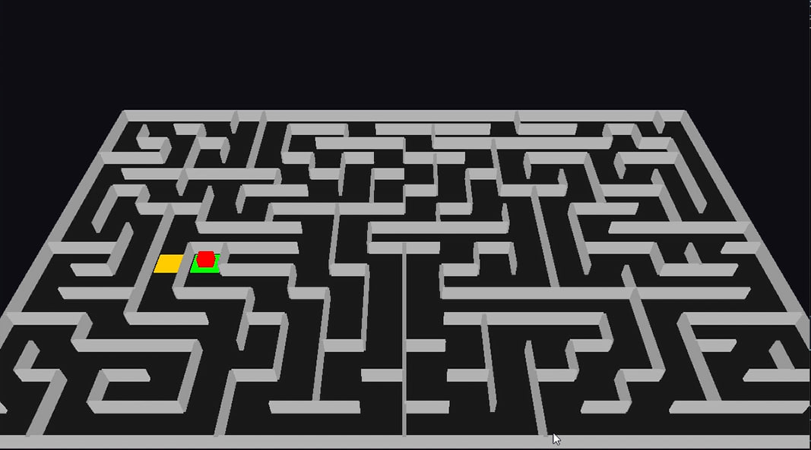
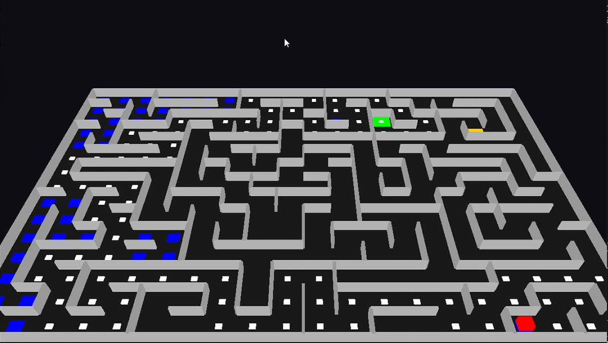
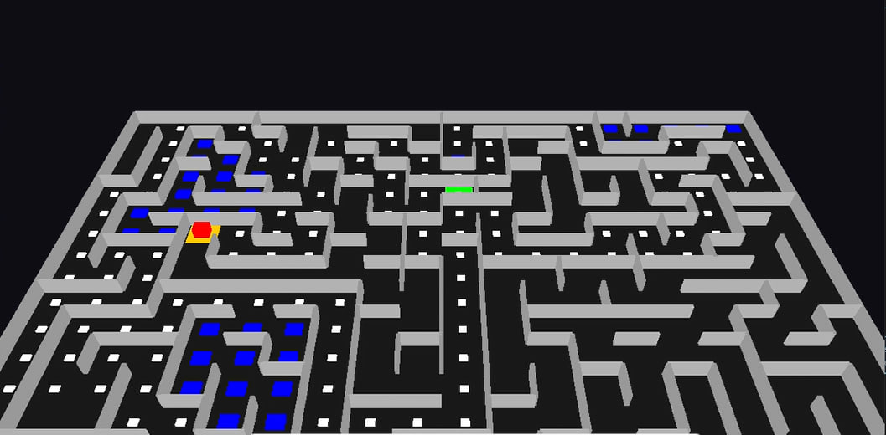

# 3D Procedural Maze Generation and Autonomous Navigation

## Project Title
**Visualizing Backtracking Algorithms through 3D Simulation**
Loom recording link: https://www.loom.com/share/26e5431797fa4d4b9f4136ba461c56d5

---

## Technical Description

This project is a real-time 3D simulation developed to demonstrate the fundamental principles of **graph traversal** and **procedural content generation**. The system constructs and navigates a complex environment using standard data structures and algorithmic logic.

The implementation is divided into two core algorithmic phases:

### 1. Procedural Maze Generation (DFS)
The environment is generated using a **Stack-based Depth-First Search (DFS)** algorithm. 
* **Mechanism:** The "generator" moves through a grid, removing walls between adjacent cells based on random selection from a stack of unvisited neighbors.
* **Integrity:** The maze is stored in two 2D matrices (`north_wall` and `east_wall`), ensuring strict wall integrity and a "perfect" maze structure (one unique path between any two points).

### 2. Autonomous Backtracking Solver
After generation, an autonomous "Rat" agent is deployed to solve the maze. 
* **Algorithm:** It utilizes a **Backtracking Algorithm** to navigate from an interior start node to an interior goal.
* **Path Memory:** The agent maintains a stack of the current path, visualized by white trail markers.
* **Dead-End Logic:** Upon reaching a trapped state (no valid unvisited neighbors), the agent marks the cell with a **blue marker**, pops the stack (backtracks), and attempts the next available branch.
* **Collision Detection:** The solver interfaces directly with the `north_wall` and `east_wall` arrays to determine passable routes.

### 3. Advanced Features (Addendums)
To fulfill high-level assignment requirements, the following features were added:
* **Interior Node Logic:** Start and End points are placed randomly within the maze's interior (avoiding edges) to ensure a non-trivial solution.
* **Graph Cycles:** Approximately 5% of internal walls are randomly removed after the initial generation to create cycles and loops, testing the solver's ability to handle non-tree graph structures.
* **3D Visual Fidelity:** Implemented via **PyOpenGL**, featuring a tilted 3D perspective, depth testing, and **Texture Mapping** for a realistic animated agent (the "Real Rat").

---

## Visual Legend
* **Green Pad:** Interior Start Position
* **Gold Pad:** Interior Exit/Goal
* **Red Rat:** The Autonomous Agent
* **White Markers:** The active "Best Guess" path
* **Blue Blocks:** Identified Dead Ends (Backtracked paths)
* **Gray Geometry:** 3D Walls generated from the matrix data

## Initial Procedural State: The Closed Grid Matrix

Before the randomized Depth-First Search algorithm begins "eating" walls, the entire maze is initialized as a closed system. This is a crucial first step in procedural generation, where every possible wall exists by default.

This image visualizes that initial uniform grid state. Architecturally, this represents that the underlying `north_wall` and `east_wall` matrices are filled entirely with values of `1` (Wall Integrity intact). We also observe the predefined interior start position (green pad) and end position (gold pad), established just before the generation loop consumes the first wall.

## The Generation Phase: "Eating" the Walls

Once the initial grid is set, the randomized Depth-First Search (DFS) algorithm begins. This is the "Eating" phase where the program moves cell-by-cell, carving out a path by setting specific wall values in the matrix from `1` (wall) to `0` (path).

This image captures the maze after the generation is complete. You can see the distinct, winding corridors that have been "eaten" into the grid. Because we used a **Stack**, the resulting maze features long, complex paths rather than short, simple ones. At this stage, the maze is a "perfect tree," meaning there is exactly one way to get from any point to another (before the 5% cycle-creation addendum is applied).

### 3. Autonomous Solving: Backtracking in Action
Once generation is complete, the autonomous agent begins its search for the goal starting from the green pad. It utilizes a **Backtracking Algorithm** to navigate. As the agent explores, it leaves behind markers to visualize its logic:

* **White Footprints:** Represent the agent's current active path (stored in the program's path stack).
* **Blue Blocks:** Identify "dead ends". When the agent reaches a trapped state, it marks the cell in blue and "unwinds" the stack to return to the last valid intersection.

### 3. Autonomous Solving Phase: Logic & Navigation

Once the procedural generation is complete, the autonomous agent (the red cube) begins its search for the goal starting from the green pad. This phase demonstrates the agent's ability to navigate a complex, non-linear environment using a **Backtracking Algorithm**.

As the agent explores the maze, it leaves a real-time visual trail of its internal decision-making process:

* **Active Path Exploration (White Footprints):** These markers represent the agent's current "best guess" or active path. They correspond directly to the nodes currently held in the program's path stack.
* **Dead-End Identification (Blue Blocks):** When the agent encounters a trapped state where all adjacent options are either walls or previously visited cells it marks that cell in blue.
* **Dynamic Backtracking:** Upon hitting a dead end, the algorithm "unwinds" the stack. The agent moves backward through its footprints until it returns to the most recent intersection with an unexplored branch, ensuring a systematic and efficient search for the gold exit pad.

## Developer Information
**Developed by:** Gelila Sintayehu  
**Section:** 2  
**ID:** UGR/3508/16
